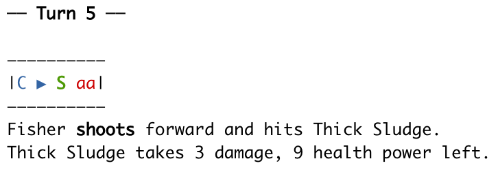

<!-- badges: start -->

[](https://github.com/trickytank/rwarrior/actions/workflows/check-standard.yaml) [](https://github.com/trickytank/rwarrior/actions/workflows/test-coverage.yaml) [](https://app.codecov.io/gh/trickytank/rwarrior?branch=master)

<!-- badges: end -->

# R Warrior

R Warrior is a game designed to teach the R language and artificial intelligence in a fun, interactive way.

You play as a warrior climbing a tall tower to reach the precious Hex at the top level. On each floor, you need to write an R function to instruct the warrior to battle enemies, rescue captives, and reach the stairs. You have some idea of what each floor contains, but you never know for certain what will happen. You must give the Warrior enough artificial intelligence up-front to find their own way.

For more information on the game, see [my blog posts with the rwarrior tag](https://tankard.id/tag/rwarrior/).

This is a port of [Ruby Warrior](https://github.com/ryanb/ruby-warrior) by Ryan Bates.



## Installation

    # install.packages("devtools") # If devtools is not installed
    devtools::install_github("trickytank/rwarrior", build_vignettes = TRUE)

## Play

Load the package:
```r
library(rwarrior)
```

Levels should be played in sequential order. So far, the beginner tower has been implemented with 9 levels.

To learn how to complete the first level, bring up the read me.

    level_readme(1)

Use the information gained to write your AI and run `play_beginner()`.

    AI <- function(warrior, memory) {
          # Your code goes here, you can ignore memory for early levels
        }
    warrior_name <- "Fisher" # A name for your warrior
        
    play_warrior(AI, warrior_name = warrior_name, level = 1)

More advanced levels require using the memory argument to the AI (or the use of a reference class). Return the memory object in your function and will pass it to the memory argument for the next call of your AI.

    AI <- function(warrior, memory) {
          if(is.null(memory)) {
            # give initial values when memory is NULL
            memory <- list(variable1 = "initial value") 
          }
          # Your code goes here #
          # Access memory variable1 with memory$variable1
          # The AI result should be the memory
          return(memory)
        }

You may want to modify the `sleep` option to `play_warrior()` to change the time between updates in seconds. Set to "prompt" to instead update on pressing the return key.

## Scoring

Your objective is to not only reach the stairs but to get the highest score you can. There are many ways you can earn points on a level.

-   defeat an enemy to add his max health to your score
-   rescue a captive to earn 20 points
-   pass the level within the bonus time to earn the amount of bonus time remaining
-   defeat all enemies and rescue all captives to receive a 20% overall bonus

Don't be too concerned about scoring perfectly in the beginning. After you reach the top of the tower, you will be able to re-run the tower and fine-tune your Warrior to get the highest score. See the Epic Mode below for details.

## Epic Mode

Once you have completed the beginner levels, it is time to take on all the levels with one AI in epic mode! Optimize your AI to get S rank in all the levels of the tower.

    play_epic(AI)

## Leader board

Submit your best AI to the [R Warrior Leader Board](https://tankard.id/post/r-warrior-leaderboard/).

# Future directions

-   Submit to CRAN (with beginner towers initially).
-   Add intermediate towers (9 more levels).
-   Create a graphical representation of the Warrior's movement. Hit me up if this is something you would be interested in helping out in, either on the programming side or creating the sprites. I'd like to see the Warrior in Pixel Art, but there would be room to have more than one skin available.
-   Create a Hex logo with a pixel-art Warrior (as used in the graphical representation).
-   Write an AI to complete the epic mode beginner tower with an S rank on all levels to find if it's possible, and adjust the ace score (target score for an S rank) accordingly. This AI is a secret!
